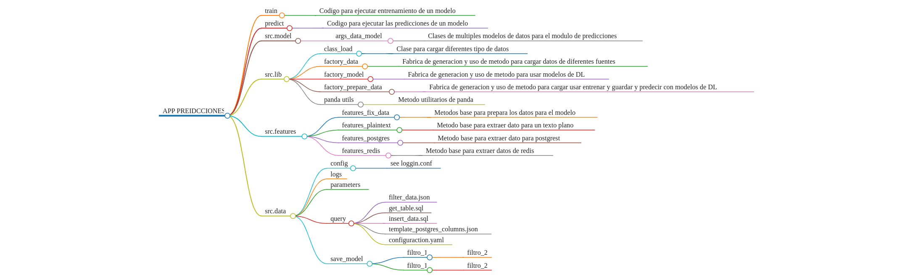

# Descripcion General del codigo

## Train

---

### train:

- Codigo para ejecutar entrenamiento de un modelo

### run_train:

- Codigo para ejecutar entrenamiento de modelo sobre una etiqueta de una fuente de datos

## predict

---

- Código para ejecutar las predicciones de un modelo

## src.model

---

### args_data_model

- Clases de multiples modelos de datos para el modulo de predicciones

## src.lib

---

### class_load

- Clase para cargar diferentes tipo de datos

### factory_data

- Fabrica de generacion y uso de metodo para cargar datos de diferentes fuentes

### factory_model

- Fabrica de generacion y uso de metodo para usar modelos de DL

### factory_prepare_data

- Fabrica de generacion y uso de metodo para cargar usar entrenar y guardar y predecir con modelos de DL

### panda utils

- Metodo utilitarios de panda

## src.model

---

### DP_model

- Metodos basicos para la generacion de modelos usando la libreria darts

### args_data_model

- Clases de datos con los parametros base de los modelos tanto de IA, como dataclass del proyecto

## src.features

---

### features_fix_data

- Metodos base para prepara los datos para el modelo

### features_plaintext

- Metodo base para extraer dato para un texto plano

### features_postgres

- Metodo base para extraer dato para postgrest

### features_redis

- Metodo base para extraer datos de redis

## src.data

---

Carpeta con multiples archivos desde configuracion hasta query y parametros de conexion

### config

- see loggin.conf
- config.yaml : archivo con los parametros de configuracion para la ejecucion de entrenamiento
- 

### logs

### parameters

### query

- filter_data.json
- get_table.sql
- insert_data.sql
- template_postgres_columns.json
- configuraction.yaml

### save_model

Ruta de guardado de modelos generados a base de filtros

- filtro_1
    - filtro_2
- filtro_1
    - filtro_2
    
    